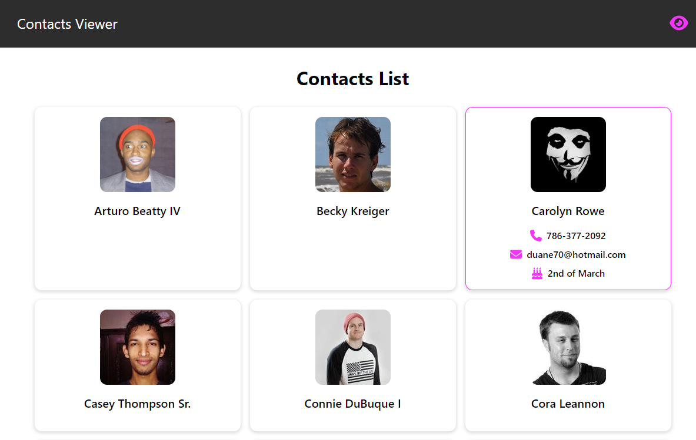

# Contacts Viewer

A simple data-driven contacts viewing application

## Tech used

- `react-query` with `axios` used in hooks for queries and mutations
- css modules for majority of component styling
- `prettier`/`eslint` configured for auto formatting and linting
- `vitests` and `react-testing-library` for testing

## What I'd do next

- Implement edit and create:
  - a new modal which contains inputs for each of the data points
  - for create, a file picker to choose avatar
- testing:
  - implement msw to mock data calls and perform more user-like UI testing
